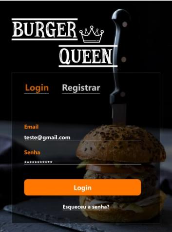
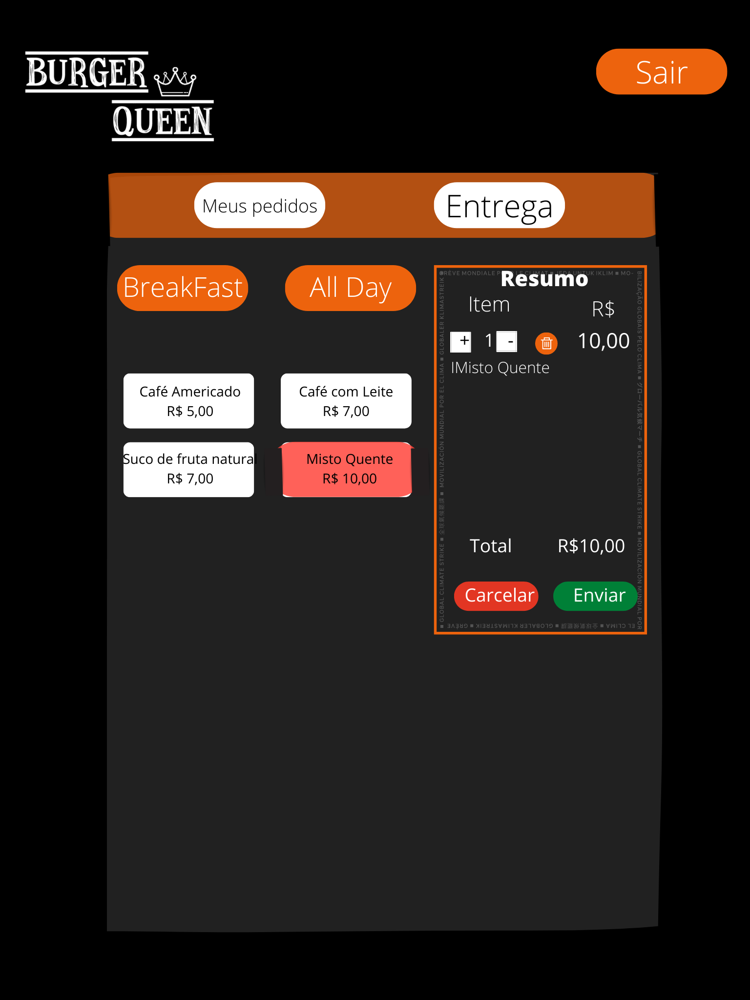
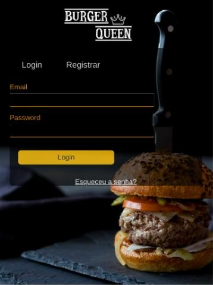
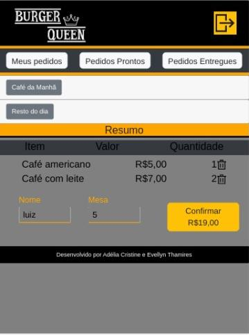
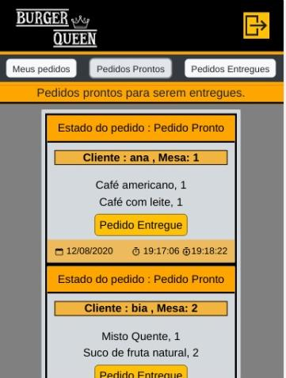

 

## Índice

* [1. Resumo do projeto](#1-resumo-do-projeto)
* [2. Montagem do ambiente](#2-montagem-do-ambiente)
* [3. Protótipo](#3-prototipo)
* [4. Futuras Implementações](#4-futuras-implementacoes)
* [5. Considerações Finais](5.consideracoes-finais)

## 1. Resumo do Projeto

A aplicação foi para ajudar na gestão/controle de pedidos dos clientes em uma Hamburgueria. Os funcionários podem se cadastrar com seu e-mail, senha e cargo e serão redirecionados para seus cargos, onde o garçom/garçonete conseguirá anotar os pedidos dos clientes, enviar para a cozinha, visualizar os pedidos prontos e entregá-los. E o cozinheiro/auxiliar de cozinha podem visualizar os pedidos á serem feitos e informar ao salão que está pronto.

## 2. Montagem do Ambiente

Esta aplicação foi desenvolvida em SPA, para uso em Tablets. 

Utilizamos:

* React JS 
* React Router
* React Hooks
* React Icons 
* React Bootstrap
* Firebase

## 3. Protótipo

O protótipo foi feito pelo Adobe XD e Canva.

E abaixo o produto final.

## 4. Futuras Implementações

* Testes que cubram 100% de statements, functions, lines e branches.

## 5. Considerações Finais

Esta aplicação foi desenvolvida por: 

Adélia Cristine : https://github.com/adeliacristine

Evellyn Thamires : https://github.com/EvellynThamires

 

